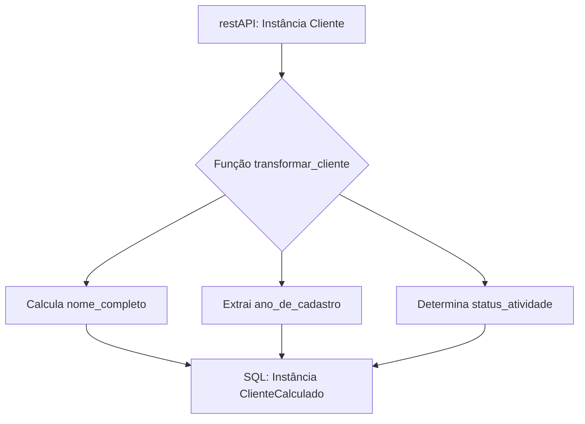

### Projeto 01: Sistema de CRM com Pydantic

### Workflow

### Explicação do Fluxo

* **A**: O processo começa com uma instância da classe `Cliente`, contendo os dados básicos do cliente.
* **B**: Esta instância é então passada para a função `transformar_cliente`, que é responsável por realizar as transformações necessárias.
    * **C**: Dentro da função, o `nome_completo` é calculado concatenando o `nome` e `sobrenome`.
    * **D**: O `ano_de_cadastro` é extraído da `data_de_cadastro`.
    * **E**: O `status_atividade` é determinado com base no valor de `is_ativo`.
* **F**: Com base nos valores calculados e nos dados originais do `Cliente`, é criada uma nova instância de `ClienteCalculado`, que agora inclui tanto os dados originais quanto os campos calculados (`nome_completo`, `ano_de_cadastro`, `status_atividade`).
#### Objetivo

Desenvolver um sistema de gerenciamento de clientes (CRM) utilizando Python e Pydantic, focado na modelagem de dados robusta e na transformação de instâncias de cliente com campos calculados. Este sistema deverá permitir a criação de perfis de clientes, aplicar transformações para gerar novos campos calculados e garantir a integridade dos dados através de testes unitários.

#### Requisitos do Sistema

1. **Contrato de dados**:
    
    * Criar um contrato de dados `Cliente` contendo informações essenciais dos clientes.
    * Implementar um contrato chamado `ClienteCalculado` que herda de `Cliente` e adiciona três novos campos calculados: `nome_completo`, `ano_de_cadastro` e `status_atividade`.
    * Esse contrato precisa ser capaz de receber dados de uma restAPI vinda da equipe de desenvolvimento
2. **Transformação de Dados**:
    
    * Desenvolver uma função `transformar_cliente` que recebe uma instância de `Cliente`, realiza cálculos para os campos adicionais e retorna uma instância de `ClienteCalculado` contendo todos os dados originais mais os campos calculados.
3. **Documentação com MkDocs**:
    
    * Documentar todo o processo de desenvolvimento, modelagem de dados, uso da função de transformação e execução de testes unitários utilizando MkDocs.
4. **Testes Unitários**:
    
    * Criar testes unitários para validar a correta transformação de instâncias de `Cliente` para `ClienteCalculado`, incluindo a verificação dos campos calculados.

#### Especificação das Classes

* **Classe `Cliente`**:
    * Campos: `nome`, `sobrenome`, `email`, `telefone` (opcional), `data_de_cadastro`, `categoria`, `empresa` (opcional), `endereco` (opcional), `is_ativo`, `id_cliente`.
* **Classe `ClienteCalculado`**:
    * Herda todos os campos de `Cliente`.
    * Adiciona campos calculados:
        * `nome_completo`: Concatenação de `nome` e `sobrenome`.
        * `ano_de_cadastro`: Ano extraído de `data_de_cadastro`.
        * `status_atividade`: Determinado com base em `is_ativo`, pode ser "Ativo" ou "Inativo".

#### Transformação de Dados

A função `transformar_cliente` deve realizar as seguintes operações:

* Concatenar `nome` e `sobrenome` para formar `nome_completo`.
* Extrair o ano de `data_de_cadastro` para definir `ano_de_cadastro`.
* Definir `status_atividade` com base no valor de `is_ativo`.

#### Documentação

Utilizar MkDocs para criar uma documentação detalhada do projeto, incluindo:

* Uma introdução ao projeto e seus objetivos.
* Descrições detalhadas das classes `Cliente` e `ClienteCalculado`.
* Um guia sobre como utilizar a função `transformar_cliente`.
* Instruções para executar os testes unitários.

#### Testes Unitários

Desenvolver testes unitários usando o framework `pytest` para:

* Testar a criação de instâncias de `Cliente` e `ClienteCalculado`.
* Verificar se a transformação de `Cliente` para `ClienteCalculado` é realizada corretamente, incluindo a validação dos campos calculados.

#### Entrega

O projeto deve ser entregue como um repositório Git contendo:

* O código-fonte do projeto.
* A configuração e documentação do MkDocs.
* Arquivos de testes unitários.
* Um `README.md` com instruções sobre como instalar, configurar e utilizar o sistema, além de como executar os testes unitários.

Este projeto visa não apenas aplicar conceitos avançados de modelagem de dados com Pydantic e Python mas também praticar a documentação de software e testes automatizados, essenciais para o desenvolvimento de software robusto e confiável.