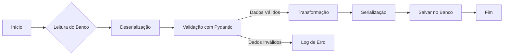

# Workshop 05


### Deserialization (Transformando os dados no Pydantic)

### Serialization (Transformando os dados no Pydantic no final)

```python
from pydantic import BaseModel, ValidationError

class Produto(BaseModel):
    name: str
    quantity: str
    price: int
    is_stock: bool

produto_01 = Produto(name="Video Game",
                    quantity=30,
                    price= 40.50,
                    is_stock=True)

print(produto_01.model_dump())

print(type(produto_01.model_dump()))

print(produto_01.model_dump())

print(type(produto_01.model_dump_json(indent=2)))
```

## 3. Type Coercion

No Pydantic, o _Type Coercion_ (Coerção de Tipo) é um recurso poderoso que permite a conversão automática de tipos de dados durante a validação de modelos. Este recurso facilita a manipulação de dados provenientes de fontes diversas, como JSON de uma API web, formulários de entrada de usuário ou bancos de dados, onde os tipos de dados podem não corresponder exatamente ao esperado pelo seu modelo de dados.

### Tipos de Type Coercion no Pydantic

Pydantic suporta coerção de tipo tanto em modos "lax" (flexível) quanto "strict" (estrito). A seguir, vamos discutir como o Pydantic lida com a coerção de tipo para diferentes tipos de dados:

* **Inteiros e Floats**: Pydantic tentará converter strings que representam números inteiros ou de ponto flutuante para os respectivos tipos `int` ou `float`. Isso é útil quando dados numéricos são recebidos como strings de um formulário web ou uma API JSON.
    
* **Strings para Booleanos**: Em um contexto flexível, strings como "true", "True", "1", "on", "yes" serão convertidas para `True`, e strings como "false", "False", "0", "off", "no" para `False`. No modo estrito, apenas valores booleanos são aceitos.
    
* **Strings para Enums**: Pydantic pode converter strings para Enums baseados nos valores dos Enums, facilitando a aceitação de dados de formulários ou APIs onde o valor é passado como string.
    

### Exemplos de Type Coercion

Nos exemplos fornecidos, o Pydantic demonstra sua capacidade de converter tipos de dados durante a validação dos modelos `Coordinates` e `Produto`.

* **Coordenadas**: No exemplo `Coordinates`, os valores `x=1.1` e `y=2.2` são aceitos diretamente como `floats`. Ao passar `x=0` e `y="3.3"`, Pydantic automaticamente converte `y` de uma string para `float`, demonstrando a coerção de tipo para números de ponto flutuante.
    
* **Produto**: Nos exemplos de `Produto`, Pydantic manipula a coerção de tipo de várias maneiras:
    
    * `is_stock=True` é passado diretamente como um booleano.
    * `is_stock="true"`, `is_stock="yes"`, e mesmo `is_stock="no"` e `is_stock="f"` são exemplos de como strings podem ser coeridas para valores booleanos, com "true", "yes" convertidos para `True` e "no", "f" para `False`.

### Modo Estrito vs. Modo Flexível

O modo estrito ("Strict Mode") é usado para desativar a coerção de tipo, exigindo que os tipos de dados de entrada correspondam exatamente aos tipos definidos no modelo. Isso é útil quando você precisa garantir que os dados não sejam apenas válidos, mas também exatamente do tipo esperado sem conversão.

Por exemplo, ao validar em modo estrito, Pydantic não converteria uma string "3.3" para um `float` ou "true" para um `True` booleano; ele levantaria uma `ValidationError`.

### Considerações Finais

_Type Coercion_ é uma característica valiosa do Pydantic, tornando-o extremamente útil para aplicações que necessitam processar dados de diferentes fontes e formatos. Ele simplifica a validação e transformação de dados, garantindo que os modelos de dados sejam consistentes e confiáveis. No entanto, é importante usar a coerção de tipo conscientemente, especialmente em contextos onde a precisão e a integridade dos tipos de dados são críticas, podendo optar pelo modo estrito quando necessário.

### Usando Tipos Strict

Aqui está um exemplo de como você pode usar tipos strict em um modelo Pydantic:

```python
from pydantic import BaseModel
from pydantic.types import StrictStr, StrictInt, StrictBool

class StrictModel(BaseModel):
    name: StrictStr
    age: StrictInt
    subscriber: StrictBool

# Isso irá passar porque os tipos são exatamente corretos
model = StrictModel(name="Alice", age=30, subscriber=True)

# Isso irá falhar com ValidationError porque 'age' e 'subscriber' esperam tipos estritos
# model = StrictModel(name="Bob", age="30", subscriber="true")
```

Neste exemplo, `StrictStr`, `StrictInt` e `StrictBool` são usados para garantir que os valores para `name`, `age` e `subscriber` sejam estritamente uma string, um inteiro e um booleano, respectivamente. Tentar criar uma instância de `StrictModel` com tipos que não correspondam exatamente resultará em uma `ValidationError`.

### Outras Formas de Aplicar Tipos Estritos

Se você está procurando alternativas aos tipos strict para controlar a coerção de tipos ou para validar dados mais precisamente sem recorrer diretamente aos tipos strict, aqui estão algumas opções:

1. **Validadores Personalizados**: Você pode usar validadores personalizados com o decorador `@field_validator` para realizar verificações de tipo customizadas ou lógica de validação que não se limite apenas à coerção de tipo.

```python
from pydantic import BaseModel, validator

class CustomValidationModel(BaseModel):
    age: int  # Tipo normal, mas vamos validar estritamente

    @field_validator('age')
    def check_age_is_int(cls, value):
        if not isinstance(value, int):
            raise ValueError('Age must be an integer')
        return value

# Isso permite uma validação mais flexível e lógica customizada
```

2. **Uso de Anotações de Tipo Padrão com Validações Adicionais**: Em alguns casos, você pode querer permitir a coerção de tipos mas ainda assim realizar verificações adicionais. Isso pode ser feito combinando anotações de tipo padrão com validadores personalizados para verificar propriedades específicas dos dados além do tipo.
    
3. **Configuração do Modelo**: Outra abordagem envolve a utilização da configuração interna do modelo Pydantic para ajustar o comportamento de validação, embora isso geralmente afete a coerção de tipo de maneira mais ampla e não seja específico para campos individuais.

[Conversion Table](https://docs.pydantic.dev/latest/concepts/conversion_table/#__tabbed_1_4)

## 4. Campo Obrigatórios, Opcionais (optional) e Campo Nulo

No Pydantic v2, o conceito de campos obrigatórios versus opcionais é central para definir modelos de dados que refletem com precisão as expectativas e restrições dos seus dados. Em engenharia de dados, onde o processamento e a validação precisos dos dados são fundamentais, entender como e quando marcar campos como obrigatórios ou opcionais é crucial para a construção de pipelines de dados robustos e confiáveis.

### Campos Obrigatórios

Um campo é considerado obrigatório no Pydantic quando é declarado em um modelo sem um valor padrão. Isso significa que o campo deve ser fornecido sempre que uma instância do modelo é criada. Campos obrigatórios são essenciais para garantir que dados críticos não sejam omitidos, contribuindo para a integridade e a validade dos dados processados.

### Campos Opcionais

Um campo é considerado opcional quando você utiliza a tipagem `Optional` do módulo `typing` ou quando um valor padrão é atribuído ao campo na declaração do modelo. Campos opcionais são úteis quando certos dados podem não estar disponíveis ou não são necessários em todas as instâncias do modelo.

### Exemplo: Modelo de Dados para Engenharia de Dados

Vamos considerar um exemplo focado em engenharia de dados, onde definimos um modelo Pydantic para dados de produtos coletados de diferentes fontes para serem processados em um pipeline de dados.

```python
from pydantic import BaseModel
from typing import Optional

class Produto(BaseModel):
    id: int  # Campo obrigatório
    nome: str  # Campo obrigatório
    descricao: Optional[str] = None  # Campo opcional
    preco: float  # Campo obrigatório
    estoque: int = 0  # Campo opcional com valor padrão
    categoria: Optional[str] = None  # Campo opcional

# Instância válida: todos os campos obrigatórios estão presentes
produto_01 = Produto(id=1, nome="Teclado Mecânico", preco=200.0)

# Instância válida: inclui dados opcionais
produto_02 = Produto(id=2, nome="Mouse Gamer", descricao="Mouse com DPI ajustável", preco=150.0, estoque=10, categoria="Periféricos")

# Tentativa de instância sem todos os campos obrigatórios resultará em erro
# produto_03 = Produto(nome="Monitor")
```

### Aplicação em Engenharia de Dados

Em um pipeline de dados, esses modelos podem ser usados para validar a entrada de dados de diferentes fontes antes de processá-los ou armazená-los em um data warehouse ou banco de dados. Por exemplo, ao receber dados de produtos de uma API ou de um arquivo CSV, o modelo `Produto` garante que todos os registros tenham os campos obrigatórios `id`, `nome`, e `preco`, enquanto permite que `descricao`, `estoque`, e `categoria` sejam omitidos.

Isso não só ajuda a manter a qualidade e a consistência dos dados mas também facilita a manipulação de dados, permitindo que o pipeline de dados lide eficientemente com variações na disponibilidade de dados entre diferentes registros.

### Conclusão

O uso adequado de campos obrigatórios e opcionais em modelos Pydantic é fundamental para a engenharia de dados, garantindo que os pipelines de dados sejam construídos com uma forte validação de dados e flexibilidade para acomodar diferentes formatos e fontes de dados. Essa abordagem melhora a robustez e a confiabilidade dos sistemas de processamento de dados, contribuindo para a eficiência geral e a qualidade dos insights derivados dos dados.


## 5. Projeto