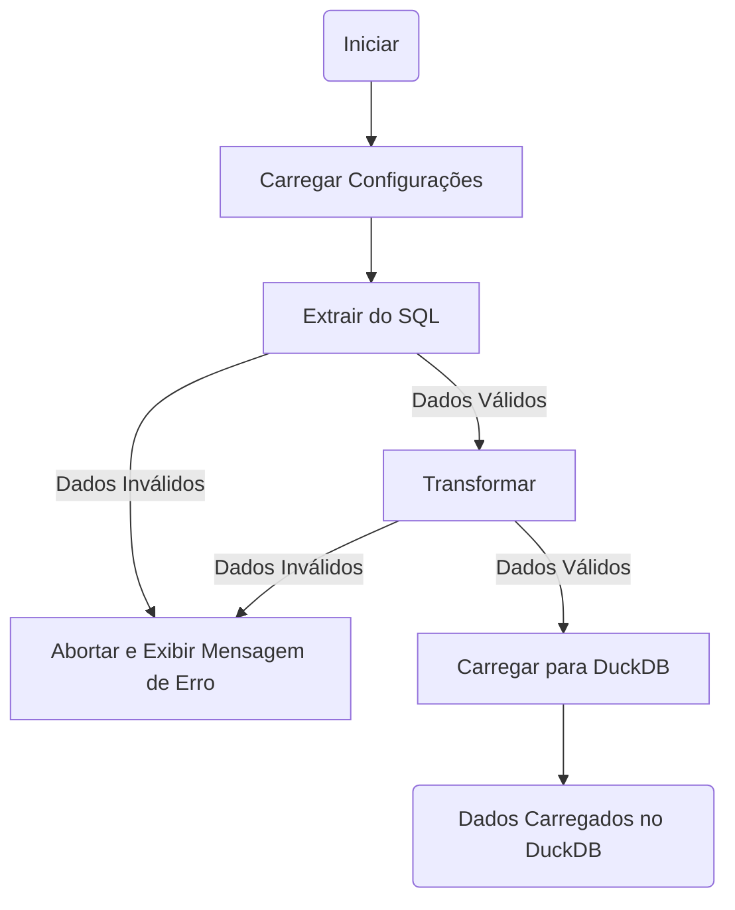

### Desafio 02: Sistema de Gestão ERP com Pandas e Pandera

# Índice

- [Workflow](#workflow)
- [Transformacoes](#transformacoes)
- [Contrato](#contrato)

# Workflow

# Transformacoes

## Configurações de Carga

::: app.etl.crm_refactor_11_doc_string.load_settings

## Extração de Dados SQL

::: app.etl.crm_refactor_11_doc_string.extrair_do_sql

## Transformação de Dados

::: app.etl.crm_refactor_11_doc_string.transformar

## Carga para DuckDB

::: app.etl.crm_refactor_11_doc_string.load_to_duckdb

# Contrato

## Tabela Bronze

::: app.etl.schema_class_email_kpi_docstring.ProdutoSchemaEmail

## Tabela Gold

::: app.etl.schema_class_email_kpi_docstring.ProdutoSchemaEmailKPI
